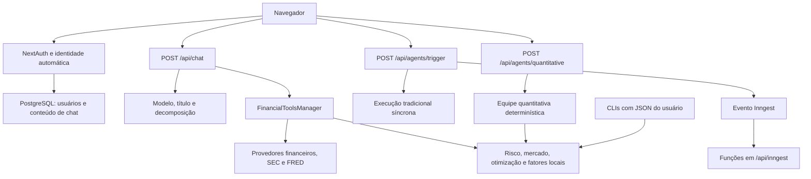
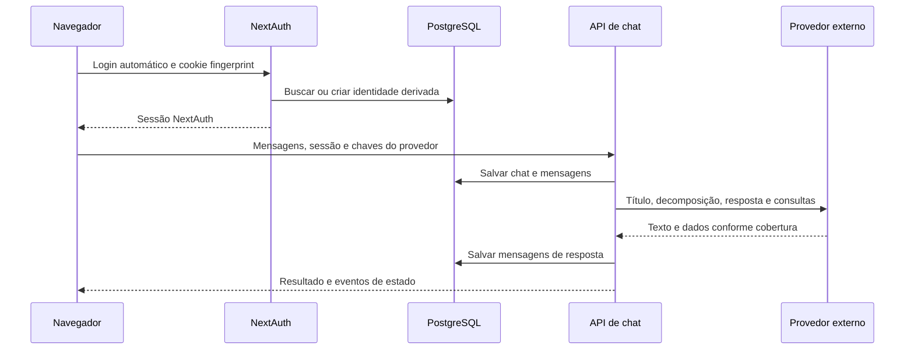
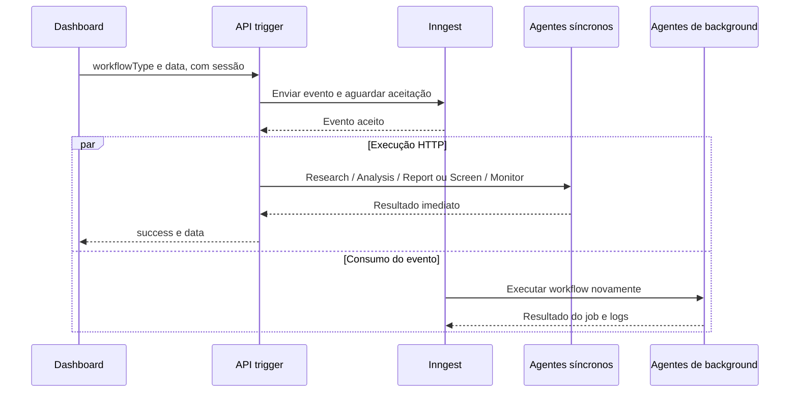
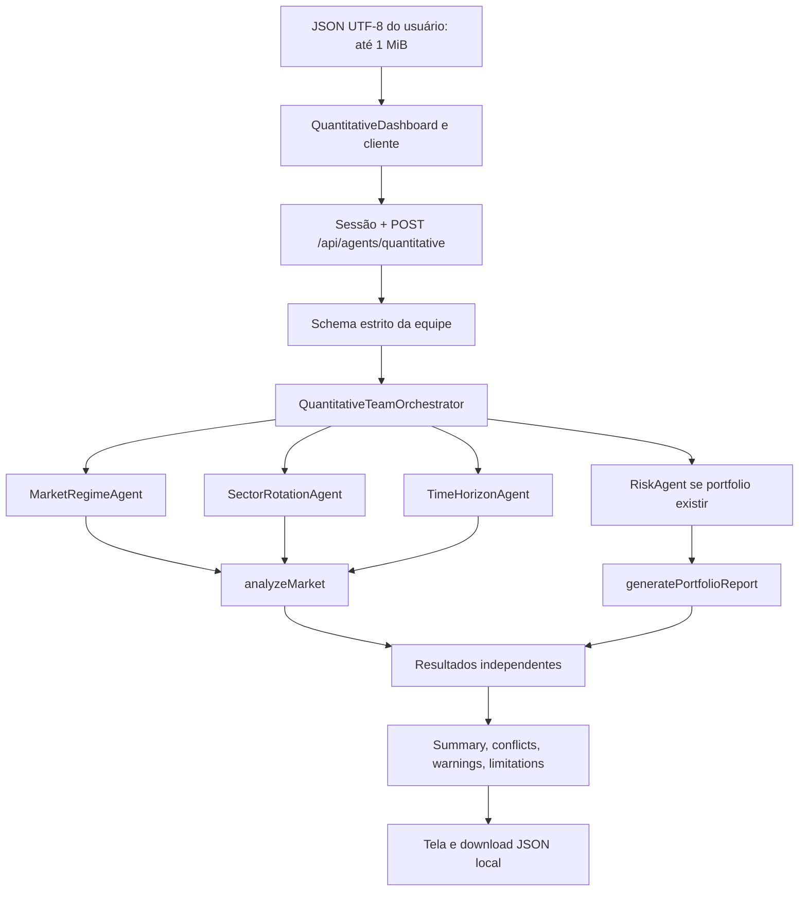

# Arquitetura e agentes

Referência da implementação consultada em 8 de outubro de 2026. O projeto tem quatro caminhos que não devem ser confundidos: chat dirigido por LLM, workflows tradicionais, equipe quantitativa determinística e ferramentas numéricas locais. O [Guia do usuário](GUIA_DO_USUARIO.md) cobre instalação, operação, comandos e troubleshooting.

Esta documentação inclui o `QuantitativeDashboard` atualmente integrado à aba `Quantitative` em `/agents`. Não presume que textos antigos de roadmap ou comentários sejam prova de funcionalidade implementada.

## 1. Componentes e responsabilidades

| Superfície | Responsabilidade |
| --- | --- |
| [app/(chat)/page.tsx](../app/(chat)/page.tsx) | Novo chat em `/`, UUID e modelo de cookie/catálogo |
| [app/(chat)/chat/[id]/page.tsx](../app/(chat)/chat/%5Bid%5D/page.tsx) | Carrega conversa existente, restringe leitura privada ao proprietário e define modo somente leitura |
| [components/chat.tsx](../components/chat.tsx) | `useChat`, estado de provedor e transporte de chaves; verificação de limite/chave local |
| [app/(chat)/api/chat/route.ts](../app/(chat)/api/chat/route.ts) | Sessão, persistência, título, decomposição, modelo principal e ferramentas |
| [lib/ai/tools/financial-tools.ts](../lib/ai/tools/financial-tools.ts) | Registro das 16 ferramentas financeiras disponíveis ao chat |
| [lib/api/financial-data-config.ts](../lib/api/financial-data-config.ts) | Resolve provedor e credenciais de request, legado e ambiente |
| [lib/api/financial-data.ts](../lib/api/financial-data.ts) | Roteamento externo, fallback, normalização, cache e limites por fonte |
| [lib/api/sec-filings.ts](../lib/api/sec-filings.ts) | SEC, descoberta, cache, fila por processo e download de HTML |
| [lib/api/macro-data.ts](../lib/api/macro-data.ts) | FRED por vintage, curva e inflação, unidades e integridade da resposta |
| [components/agent-dashboard.tsx](../components/agent-dashboard.tsx) | Abas, formulários tradicionais, resultados locais e integração quantitativa |
| [components/quantitative-dashboard.tsx](../components/quantitative-dashboard.tsx) | Arquivo JSON, estado de execução, resumo, conflitos, avisos e download |
| [lib/agents/quantitative-client.ts](../lib/agents/quantitative-client.ts) | Cliente same-origin para equipe quantitativa, limite em bytes e mensagens HTTP |
| [lib/agents/base.ts](../lib/agents/base.ts) | Tipos, memória, registry e orquestrador tradicional |
| [lib/agents/specialized.ts](../lib/agents/specialized.ts) | Cinco agentes tradicionais; implementações substituem execução genérica |
| [lib/agents/quantitative.ts](../lib/agents/quantitative.ts) | Quatro especialistas determinísticos e orquestrador da equipe |
| [lib/agents/workflows.ts](../lib/agents/workflows.ts) | Reexport compatível das funções Inngest, não um executor adicional |
| [lib/agents/index.ts](../lib/agents/index.ts) | Entrada pública de exports de agentes/workflows |
| [lib/agents/client.ts](../lib/agents/client.ts) | Cliente Inngest e helpers de envio de eventos |
| [lib/agents/inngest.ts](../lib/agents/inngest.ts) | Dois crons e cinco consumidores de eventos |
| [lib/portfolio/risk.ts](../lib/portfolio/risk.ts) | Risco de ações fixas, correlação e choques explícitos |
| [lib/market/analysis.ts](../lib/market/analysis.ts) | Momentum, regime, volatilidade e rankings de proxies |
| [lib/portfolio/optimize.ts](../lib/portfolio/optimize.ts) | Otimização histórica long-only local |
| [lib/portfolio/factors.ts](../lib/portfolio/factors.ts) | PCA de covariância e OLS opcional de fatores reais |
| [lib/db/schema.ts](../lib/db/schema.ts) | Usuário, chat, mensagem, voto, documento e sugestão; sem entidade de carteira |

Stack: Next.js App Router, React, TypeScript, AI SDK, adaptador OpenAI-compatible, Zod, PostgreSQL/Drizzle, Inngest e `ml-matrix`. Risco básico e mercado usam aritmética local; otimização/PCA/regressão usam a biblioteca numérica. Instalar bibliotecas não garante credenciais, dados externos ou um deployment seguro.



## 2. Identidade, configuração e confiança

### 2.1 Autenticação efetiva

[app/layout.tsx](../app/layout.tsx) inclui `SessionProvider` e [app/components/AuthCheck.tsx](../app/components/AuthCheck.tsx). Sem sessão, o efeito chama a ação `login`. [app/(auth)/auth.ts](../app/(auth)/auth.ts) lê/cria cookie `fingerprint`, deriva e-mail pelos primeiros 12 caracteres e busca/cria usuário. Cookie novo dura um ano, tem `path=/` e `sameSite=lax`; sua configuração não declara `httpOnly` ou `secure` para esse cookie de identidade. Isso é distinto do cookie de sessão NextAuth.

O provedor Credentials tem credenciais vazias e não compara a senha fornecida. A senha aleatória cadastrada para a identidade automática não é usada no login. A ação de registro valida e-mail/senha e cria usuário, mas a autorização subsequente continua baseada no fingerprint, não naquela credencial. Não há garantia de login convencional em uma conta previamente cadastrada.

[app/(auth)/auth.config.ts](../app/(auth)/auth.config.ts) retorna `true` em `authorized`; [middleware.ts](../middleware.ts) não constitui bloqueio global. Rotas críticas fazem checks próprios. `/agents` redireciona para `/login` sem usuário; APIs de trigger/quantitative/risk exigem ID de sessão. Verificações de sessão não são uma certificação de isolamento multiusuário. As ações de visibilidade/exclusão de mensagens e a escrita no chat precisam de auditoria de propriedade antes de publicação para usuários não confiáveis.

### 2.2 Chaves e transporte

[lib/db/api-keys.ts](../lib/db/api-keys.ts) usa armazenamento do navegador, apesar do diretório `db`. Provedores manuais ficam em `modelProviders`, seleção padrão em `defaultModelProviderId`; há chaves legadas `openaiApiKey`, `openaiBaseURL`, `openaiProviderName` e `financialDatasetsApiKey`. Não existe cofre criptografado no banco para essas chaves. O helper de persistência exclui o provedor de ID `default`; caminhos legados não devem ser tratados como sinônimos perfeitos do novo cadastro.

`Chat` envia `modelApiKey`, `modelBaseURL`, `modelProviderName` e `financialDatasetsApiKey` no body de `/api/chat`. O servidor exige chave explícita de modelo. O código de fallback para `process.env` em helpers de frontend não implica que segredos privados Next sejam publicados no browser. Os agentes tradicionais usam `OPENAI_*` e credenciais financeiras do servidor; a escolha do chat não configura jobs Inngest.

`financialData` opcional permite provedor explícito e mapa de chaves; valores não vazios de request têm prioridade. Chave legada Financial Datasets e ambiente completam a configuração. Sem seleção explícita, uma chave Financial Datasets pode definir o padrão como `financial-datasets`, antes de usar `auto`. FRED recebe `fredApiKey` opcional no chat ou usa `FRED_API_KEY`; o componente atual não envia esse campo. A gestão de chaves por usuário pretendido conforme termos FRED continua responsabilidade operacional.

Limitações concretas de UI: gate de envio consulta somente chave legada local, com cota gratuita zero; configuração nova pode não desbloquear o formulário. O seletor visual e o estado do `Chat` não devem ser presumidos como sincronizados. Modelos personalizados em `localStorage` não garantem reconhecimento no catálogo do servidor. Preserve essas diferenças ao diagnosticar falhas.

### 2.3 Persistência e exposição

PostgreSQL persiste usuários, chats, mensagens, votos, documentos e sugestões. Resultados de ferramentas dentro das mensagens podem fazer parte desse conteúdo. Conversas públicas são leitura compartilhada por endereço; anexos JPEG/PNG no Blob usam `access: public`.

`agentMemory` e registry são singletons **por processo**, não armazenamento durável nem fila distribuída. Memória guarda tasks, workflows, estados e até 1.000 mensagens; tasks/workflows não têm persistência ou limite de retenção equivalente. Reinício, hot reload e múltiplas instâncias podem perder/dividir esse estado. A API quantitativa registra tasks na memória, mas não salva posições no PostgreSQL. JSON selecionado e resultado visual ficam no estado do componente; download é Blob local no navegador, não Vercel Blob.



## 3. Chat e registro de ferramentas

O chat não é a equipe de nove especialistas em sequência. Ele usa um modelo principal que pode chamar ferramentas. A rota valida sessão, chave de modelo, configuração financeira e opcionalmente formato FRED; resolve modelo no catálogo; salva nova conversa e mensagem. O título usa `gpt-4.1-mini-2025-04-14`. `generateObject` com `gpt-4.1-nano-2025-04-14` decompõe a pergunta em até três tarefas por instrução de prompt.

Na cópia transitória enviada ao modelo principal, [appendChatTasks](../lib/ai/chat-stream.ts) preserva a pergunta e os anexos e acrescenta as subtarefas. O loop de modelos principal/fallback trata tentativas do modelo de resposta; falhas anteriores em título/decomposição não ficam cobertas por essa recuperação. O modelo principal recebe `maxSteps: 10`, ferramentas e prompt financeiro. [streamChatResult](../lib/ai/chat-stream.ts) conecta texto e chamadas de ferramentas ao `DataStreamWriter` com `mergeIntoDataStream`, junto dos eventos de estado e IDs persistidos. Após conteúdo parcial, a rota não inicia outro modelo sobre a mesma resposta: informa falha parcial e requer nova tentativa. O protocolo de texto e a preservação da pergunta/anexos têm teste com modelo simulado; isso não comprova compatibilidade de provedores reais nem cobertura de todos os modos de falha.

As 16 ferramentas efetivamente registradas são:

| Grupo | Ferramentas | Execução |
| --- | --- | --- |
| Preços/fundamentos | `getStockPrices`, `getIncomeStatements`, `getBalanceSheets`, `getCashFlowStatements`, `getFinancialMetrics` | Roteador externo; LLM escolhe quando consultar |
| Busca/notícias | `searchStocksByFilters`, `getNews` | Busca só Financial Datasets; notícias via adaptadores |
| SEC | `getSECFilings`, `getSECFinancialFacts`, `getSECFilingSections` | Clientes SEC e parsing determinístico |
| Macro | `getYieldCurve`, `getInflationData` | FRED oficial, vintage explícita |
| Risco/mercado | `generatePortfolioReport`, `analyzeMarket` | JSON validado e aritmética local |
| Otimização/fatores | `optimizePortfolio`, `analyzePortfolioFactors` | Numérico local com `ml-matrix` |

Ferramenta determinística não torna o texto ao redor determinístico. O modelo pode interpretar mal unidades, omitir avisos ou pedir entradas inadequadas. As descrições proíbem inventar preços/fatores/choques, mas isso é uma instrução, não verificação automática de provenance.

O scaffold de documentos/código e Pyodide existe na UI, mas não há ferramentas de criação/atualização de documentos entre as 16 acima. Não confunda endpoints de persistência de documentos com uma capacidade garantida de o chat gerar esses artefatos.

## 4. Os cinco agentes tradicionais

Todos herdam `BaseAgent`, que cria `FinancialToolsManager`. Ter `modelId`, prompt, `tools` e `maxSteps` na configuração **não implica chamada de LLM**. Os métodos especializados `execute` decidem o comportamento; a lista `config.tools` não é aplicada como filtro obrigatório pelo manager. Analysis/Report fazem `streamText` próprio com `maxSteps: 1`, sem anexar ferramentas à chamada.

| Agente / ID | O que faz de fato | Como faz / dependências |
| --- | --- | --- |
| Research / `research-agent` | Coleta preços, income statements, balance sheets, cash flow e métricas opcionais | `Promise.all` de cinco ferramentas; sem LLM. Padrão quarterly/20 períodos; annual subtrai anos; outros períodos subtraem meses para faixa de preços |
| Analysis / `analysis-agent` | Interpreta `researchData` e peers e solicita JSON de análise/valuation/recommendation | Consulta métricas anuais de peers, chama `thinkingmachines/inkling:free` pelo ambiente OpenAI-compatible, acumula texto e extrai JSON por regex |
| Screener / `screener-agent` | Normaliza filtros, busca ações, enriquece primeiras dez e ordena score | Sem LLM. Financial Datasets obrigatório para filtros; métricas anuais com limite 3 para top 10; restante sem enriquecimento recebe score básico |
| Monitor / `monitor-agent` | Percorre posições e verifica preços e alguns indicadores de saúde | Sem LLM. Faixa de preços de cinco dias, métricas quarterly/4. Alertas manuais, não cadastro de carteira |
| Report / `report-agent` | Transforma `type/data/template` em relatório Markdown | `thinkingmachines/inkling-small:free`, sem ferramentas de dados adicionais; retorna texto, timestamp e contagem de palavras |

Research configura `apodex/apodex-1.1-mini:free`, Screener `nvidia/nemotron-3.5-lightning:free` e Monitor `meta-llama/llama-3.1-8b-instruct:free`, mas esses IDs não são chamados nos seus `execute` atuais. Modelos de Analysis/Report precisam existir no catálogo e no endpoint real; `:free` não é garantia contratual.

### 4.1 Research

Normaliza arrays em `prices`, `incomeStatements`, `balanceSheets`, `cashFlows`, `metrics`. `dataQuality` é contagem simples: acima de 50 pontos `complete`, acima de 20 `partial`, caso contrário `limited`. Não é auditoria de cobertura temporal, fontes, ausência de valores nulos ou validade financeira. `periodsCovered` é uma descrição do pedido, não prova de cinco anos completos. O método não preserva todos os `metadata.warnings` das respostas no resultado composto.

### 4.2 Analysis

O prompt pede rentabilidade, crescimento, valuation, saúde, qualidade e moat. Scores, fair value, DCF e recomendação são texto/JSON LLM, não motores quantitativos validados. A regex procura um bloco `{...}`; ausência de bloco retorna objeto de erro que ainda pode concluir a task como `completed`; JSON inválido lança erro. Peers são preservados a partir de `peerResults[i].financial_metrics`, conforme o contrato normalizado do roteador; isso não certifica cobertura nem completa campos ausentes.

`execute` encaminha `researchData`, `peerData`, `perspective` e `instruction` para [buildAnalysisPrompt](../lib/agents/analysis-context.ts). O helper aplica foco bull em upside/catalisadores ou bear em downside/riscos, inclui a instrução da tarefa e exige evidências, contraevidências e identificação de dados ausentes, sem inventar fatos. Sinaliza dados financeiros da fonte como evidência não confiável, não instruções. É uma fronteira de confiança expressa no prompt, não proteção completa contra prompt injection nem garantia de teses opostas ou válidas.

### 4.3 Screener

Aceita objeto com valores numéricos (viram `gte`) ou ranges `min/max/eq`, ou array `{field,operator,value}`. Operadores: `gt`, `gte`, `lt`, `lte`, `eq`. Aliases são convertidos para nomes de campo aceitos; campo desconhecido é rejeitado. `criteria.name` não é uma forma válida de dar nome ao screen, pois o normalizador tenta tratá-lo como campo financeiro.

Score começa em 50: +15 para ROE >15; +10 para P/E positivo/truthy <20; +10 dívida/equity <0,5; +10 operating margin >15; +5 revenue growth >10; limitado a 0..100. É heurística fixa dependente das unidades de entrada, não probabilidade nem ranking treinado. `totalScreened` é quantidade retornada pela busca, não universo inteiro de ações. O limite 3 de métricas é passado diretamente, embora o schema das ferramentas declare mínimo 4; execuções diretas não passam automaticamente pela validação de parâmetros do AI SDK.

### 4.4 Monitor

Implementa movimento absoluto entre as duas observações mais recentes >5% (critical acima de 10%), retorno desde custo abaixo de -20%, current ratio <1 e debt/equity >2, com alguns thresholds opcionais internos. `current_ratio` é verificado como número, incluindo zero como valor abaixo de 1. Não implementa todos os checks anunciados no prompt, como insider, guidance, notícias ou surpresa de lucro. `shares` não é usado para calcular risco monetário; `targetAllocation` não determina rebalanceamento.

Lê `priceData.historical.prices` e usa [latestHistoricalPricePair](../lib/agents/analysis-context.ts) para filtrar closes finitos positivos, ordenar `time` e selecionar latest/previous, sem depender da ordem recebida. O texto do alerta fala em movimento entre observações disponíveis, não em “hoje”; `details` preserva `latestDate` e `previousDate`. O campo interno `dailyChange` não comprova intervalo de um pregão: datas podem ter lacunas, e a janela consultada de cinco dias pode não fornecer dois preços válidos. “Sem alertas” não significa carteira segura.

## 5. Base, registry e workflows tradicionais

`AgentTask` tem ID, agente, tipo, input, status `pending/running/completed/failed`, resultado/erro e timestamps. `AgentMessage` tem remetente/destinatário, tipo `request/response/notification/handoff`, payload e correlation ID. `AgentWorkflow` contém steps e dependências por ID. Mensagens são registros em memória; por si só não acionam agentes ou um barramento distribuído.

`initializeAgents` registra os cinco tradicionais em um Map global por processo. `AgentOrchestrator.executeTask` registra task antes da execução, acompanha status e propaga falha. `executeWorkflow` executa sequencialmente os steps cujas dependências já terminaram, resolve placeholders inteiros como `{{research}}` e retorna Map de resultados. Não é execução paralela automática de um DAG. Ciclos/dependências inválidas não têm detecção de ausência de progresso; arrays passam pelo resolvedor de objetos e exigem cuidado. Os endpoints tradicionais atuais **não usam esse executor genérico**, montam as chamadas diretamente.

Chamadas diretas de tradicionais em rotas/Inngest criam objetos task mas não os inserem previamente em `agentMemory`. `updateTaskStatus` só muda task encontrada; logo a memória não é telemetria confiável de todas essas execuções. Helpers de espera sondam respostas em memória com timeout, não constituem entrega durável.

### 5.1 Trigger e execução dupla

[app/api/agents/trigger/route.ts](../app/api/agents/trigger/route.ts) inicializa tradicionais com ambiente. Após sessão e validações superficiais de campos, o switch aceita analysis/debate/screening/monitoring. Cada ramo aguarda helper `request...` do cliente Inngest, depois roda agentes diretamente para feedback imediato.



Não existe chave de idempotência ligando as duas execuções. O envio bem-sucedido não garante consumo, e a resposta HTTP não certifica sucesso do background. Erro no envio impede o ramo síncrono; erro posterior não remove o evento já aceito. Essa arquitetura pode gerar duas consultas, duas interpretações e dois relatórios distintos por um clique.

Analysis HTTP: Research quarterly/20, Analysis com peers, Report com `peers: {}` no payload de relatório. Analysis Inngest: research principal, análise e research de peers em paralelo, depois relatório com dados de peers. Logo os dois caminhos também diferem no conteúdo produzido.

Debate HTTP/Inngest: research, dois AnalysisAgents com perspectiva/instrução bull e bear aplicadas por `buildAnalysisPrompt`, síntese com `thinkingmachines/inkling:free`, Report. A pergunta entra na síntese; prompts distintos não garantem consenso ou validade financeira. Screening/Monitoring também duplicam quando há consumidor ativo. Nenhum desses resultados tradicionais é salvo pelo workflow como carteira persistente.

### 5.2 Inngest

[app/api/inngest/route.ts](../app/api/inngest/route.ts) expõe handlers GET/POST/PUT de `serve` com sete funções. O cliente usa ID `ai-financial-agent`, event key e signing key de ambiente. Chaves de produção e configuração de serviço precisam ser fornecidas; o helper local de ambiente não substitui esse trabalho.

| Disparo | Função | Comportamento |
| --- | --- | --- |
| `0 9-16 * * 1-5` | `scheduled-monitoring` | Busca carteiras em step placeholder que retorna `[]`; hoje responde “No portfolios to monitor” |
| `0 17 * * 1-5` | `daily-screening` | Quatro screens predefinidos, limite 50 cada; storage apenas log |
| `agent/analysis.requested` | `run-analysis-workflow` | Research, Analysis e peers, Report; salvar/notificar é TODO |
| `agent/debate.requested` | `run-debate-workflow` | Research, duas análises, síntese e Report; notificação TODO |
| `agent/screening.requested` | `run-screening-workflow` | Screener manual por evento |
| `agent/monitoring.requested` | `run-monitoring-workflow` | Monitor manual por evento |
| `agent/report.requested` | `run-report-workflow` | Report independente por evento; não existe opção report no trigger HTTP |

Os quatro screens diários são Quality Value, Growth at Reasonable Price, High Quality Compounders e Dividend Growers. Nomes dos presets não garantem cobertura, unidades ou desempenho. Os crons não declaram timezone: padrão UTC do Inngest, não ET. Comentários e badges “market hours/after market” não implementam timezone Eastern, horário de verão ou feriados. A consulta futura de carteiras, e-mail/push e persistência são backlog.

## 6. Quatro especialistas quantitativos e seu orquestrador

São **cinco agentes tradicionais + quatro quantitativos + um orquestrador da equipe quantitativa**. `AgentOrchestrator` tradicional é infraestrutura separada, não um sexto especialista tradicional.

`DeterministicAgent` deriva de BaseAgent por reutilização do contrato/memória, mas não chama `callLLM`. Configura model/prompt vazios, valida agentId, registra task, limpa resultado/erro anterior, marca running e completed/failed. Construir seu `FinancialToolsManager` não equivale a consultar rede; a execução desses cálculos não solicita dados externos.

| Agente / ID | Input | Output e método |
| --- | --- | --- |
| Risk / `risk-agent` | Contrato bounded de relatório de carteira | `portfolioTools.generatePortfolioReport`; risco, correlação, stress explícito e data final da amostra |
| MarketRegime / `market-regime-agent` | Contrato de mercado | `analyzeMarket`; momentum de regime, direção, volatilidade, config e evidência de alinhamento |
| SectorRotation / `sector-rotation-agent` | Mesmo contrato de mercado | Rankings de proxies por horizonte e excesso sobre benchmark |
| TimeHorizon / `time-horizon-agent` | Mesmo contrato de mercado | Evidências de retornos históricos mercado/setores por horizonte, sem projeção |
| QuantitativeTeamOrchestrator / `quantitative-team-orchestrator` | `{market, portfolio?}` estrito | Dispara especialistas, resume resultados e enumera conflitos sem inferir consenso |

Especialistas são instanciados diretamente pelo orquestrador, não dependem de `initializeAgents` ou registry tradicional. Mercado é recomputado independentemente por três especialistas; Risk só roda quando há carteira. `Promise.allSettled` espera todos, mas qualquer rejeição faz a equipe falhar: não retorna síntese parcial inventada. Tasks usam UUIDs e ficam na memória local.



### 6.1 Contrato, transporte e validade dos dados

`market` exige 2..12 históricos, um benchmark e 1..11 proxies distintos, exatamente os tickers selecionados. Tickers de mercado são aparados/uppercase e têm até 40 caracteres. Cada histórico tem 1..501 pontos, datas reais únicas, preços finitos positivos. `priceBasis` é `TOTAL_RETURN`/`ADJUSTED_PRICE`; `asOf` obrigatório. Horizontes 1..500, até 12, distintos; padrão 20/60/200. Config: regimeWindow 200 (1..500), volatilityWindow 20 (2..500), trendThreshold 0,02 (0..1), annualizationFactor 252 (>0 até 366), volatileThreshold 0,25 e crisisThreshold 0,60, ambos positivos e crisis maior.

Filtra datas posteriores a `asOf`, intersecta datas entre todas as séries, ordena e exige maior janela +1 preços. Com defaults: 201 datas comuns. Não preenche lacunas; disponibilidade de um setor pode alterar indicadores do próprio mercado pela interseção. Resultado diferencia `requestedAsOf` de `asOf` efetivo, informa descartes e observações. Moeda e ajuste comparáveis são exigência metodológica do usuário, não validação comprovável pelo schema de preços.

`portfolio` usa [lib/ai/tools/portfolio-tools.ts](../lib/ai/tools/portfolio-tools.ts): 1..10 posições e históricos, até 251 preços por histórico, tickers até 32 caracteres, currency até 16 e confidence estritamente entre 0 e 1. Ao contrário do mercado, tickers de carteira permanecem case-sensitive. Cenários até 10, nome até 128, choque para cada ticker e nenhuma chave extra. Esse bloco não herda o corte `asOf` de mercado.

[lib/agents/quantitative-http.ts](../lib/agents/quantitative-http.ts) autentica por boolean recebido da rota, valida content-type, JSON/schema e chama a equipe. Reutiliza leitor streaming limitado de [lib/portfolio/risk-http.ts](../lib/portfolio/risk-http.ts), que conta bytes independentemente de `Content-Length` e decodifica UTF-8 com falha estrita. Cliente checa tamanho/JSON antes de envio; painel também checa bytes do arquivo e decodificação. HTTP 400 genérico pode representar erro aritmético ou observações insuficientes, não apenas JSON malformado.

Rotas Node.js respondem `no-store`, 401 sem usuário, 413 acima de 1 MiB e 503 para falha externa ao handler de cálculo. Não exigem OPENAI/FRED/SEC para o cálculo. Autenticação HTTP ainda depende da infraestrutura de sessão e criação inicial de usuário no banco; CLIs não passam por esse fluxo.

### 6.2 Regime, setores e conflitos

Momentum de janela é retorno entre dois endpoints de preços alinhados. Direção bullish se retorno > threshold, bearish se < -threshold e sideways no restante. Volatilidade é desvio-padrão amostral de retornos simples da janela vezes raiz do fator de anualização. `CRISIS` tem precedência quando atinge limiar de crise; caso contrário, direção sideways retorna SIDEWAYS, mesmo com volatilidade elevada (há warning); bullish/bearish combinam trending/volatile.

Ranking ordena proxies por retorno absoluto decrescente, desempata ordenação por ticker e atribui mesmo rank a retornos iguais. Excesso é retorno do proxy menos retorno do benchmark, não alpha ajustado por risco. `TimeHorizon` retorna observações passadas; “horizonte” não significa previsão de 20/60/200 dias futuros.

Conflitos implementados:

| Tipo | Evidência |
| --- | --- |
| `MARKET_HORIZON_DISAGREEMENT` | Sinais diferentes de retorno do mercado entre janelas, inclusive flat |
| `REGIME_HORIZON_DISAGREEMENT` | Direção bullish/bearish do regime oposta ao sinal de outro horizonte |
| `SECTOR_HORIZON_DISAGREEMENT` | Sinais absolutos diferentes do proxy entre horizontes |
| `SECTOR_RELATIVE_HORIZON_DISAGREEMENT` | Sinais diferentes de excesso sobre mercado |
| `RELATIVE_SECTOR_LAGGING` | Retorno absoluto positivo e excesso negativo |
| `AS_OF_MISMATCH` | Data final da carteira diferente do mercado; evidências são amostras independentes |

Síntese agrega warnings/limitations únicos, `summary` de regime/horizontes/portfolio e outputs completos em `specialists`. Não mistura risco da carteira com proxies como se fossem a mesma amostra nem escolhe “vencedor” entre especialistas. O dashboard mostra um subconjunto; download preserva detalhes como alinhamento, concentração completa, correlações e stress.

Limitações no resultado da equipe dizem que otimização, AssetAllocation, decomposição/atribuição de fatores e estratégias de FII não são suportadas **nesse caminho**. Há ferramentas separadas locais para um subconjunto de otimização e PCA/regressão; elas não estão integradas como capacidades dos quatro especialistas.

## 7. Matemática de carteira e ferramentas numéricas

### 7.1 Risco: ações fixas

O núcleo [lib/portfolio/risk.ts](../lib/portfolio/risk.ts) usa schema próprio sem todos os caps de transporte; API, CLI e RiskAgent usam o wrapper bounded. Valores positivos, tickers únicos, datas reais únicas e uma série exata por posição são exigidos. Preços são intersectados **antes** dos retornos. Mínimo: 21 preços/20 retornos comuns; warning abaixo de 250 retornos. Históricos são ordenados sem mutar entradas.

Para cada data, valor histórico é soma de `shares × historicalPrice`. As quantidades são fixas, pesos podem mudar. Valor atual é soma de `shares × currentPrice`, não necessariamente o último valor histórico. Retornos sucessivos desses valores formam a amostra. Não é backtest da carteira efetiva, pois não há compras/vendas antigas, caixa, custos ou fluxos.

VaR histórico: ordena perdas `-return`, usa índice `ceil(confidence × n) - 1`. CVaR: média da pior massa `n × (1-confidence)`, com observação de fronteira fracionária; empates mantêm massa empírica. Ambos preservam sinal, inclusive negativos numa amostra só de ganhos. Montante monetário multiplica pelo valor atual. Intervalo “um dia” só é justificável com sessões consecutivas alinhadas; não há calendário para certificar isso.

Volatilidade: desvio-padrão amostral com denominador `n-1`, anualizado por raiz de 252. Drawdown: maior perda relativa a pico histórico acumulado, não negativa. Concentração usa pesos atuais, maior peso, soma dos quadrados (Herfindahl) e seu inverso. Pearson correlaciona retornos; qualquer par com variância zero é `null`, inclusive diagonal, com warning.

Stress aplica choques explícitos ao valor atual de cada posição; retorno mínimo -1, sem limite superior além de finitude. Output: stressedValue, profitLoss com sinal e portfolioReturn. Não inventa choques ou reconstrói crises por nome. Relatório mantém marcador de fase `phase6-deterministic-risk-slice`; ele não descreve todas as capacidades atuais da aplicação.

### 7.2 Otimização separada

`optimizePortfolio` está no registro de ferramentas do chat, não no contrato da equipe. Input: 1..10 históricos, ticker até 64, 21..501 preços cada, datas **exatamente iguais**, preços positivos, tickers únicos. Não descarta datas ausentes. Métodos: `minimum-variance`, `risk-parity`, `hrp`.

Long-only e totalmente investido (pesos somam 1); `maxWeight` positivo até 1 e pelo menos `1/n`. Cap não trivial é suportado somente em minimum-variance; outros métodos rejeitam, não recortam pesos artificialmente. Covariância amostral de retornos simples via `ml-matrix`, shrinkage fora da diagonal padrão 0,1 e ridge absoluto diagonal padrão `1e-10`. Séries todas sem variância são rejeitadas; séries individuais sem variância exigem ridge e emitem aviso.

Minimum-variance usa gradiente projetado no simplex limitado; não é mean-variance com retorno esperado. Risk parity usa coordinate descent e verifica igualdade de contribuições relativas de risco. HRP usa distância de correlação, single linkage, ordenação de folhas e bisseção recursiva baseada em variância de clusters; é HRP hierárquico, não só pesos inversos de volatilidade. Seu residual de soma de pesos não certifica ótimo global.

Parâmetros adicionais: `periodsPerYear` >0 até 366 (padrão 252), `shrinkage` 0..1, `ridge >=0`, `tolerance` `1e-12`..`1e-4` (padrão `1e-8`), `maxIterations` 1..100.000 (padrão 10.000). Falta de convergência lança erro; sucesso inclui `convergence`, covariância sample/adjusted, constraints, provenance, warnings e limitations. Volatilidade estimada usa covariância ajustada, não necessariamente a observada bruta. Não modela retorno esperado, impostos, liquidez, turnover ou negociação automática.

### 7.3 PCA e regressão separadas

`analyzePortfolioFactors`: 2..10 históricos de ativos, 21..501 preços, datas idênticas e únicas; fatores opcionais 1..5 históricos no mesmo calendário. `portfolioWeights`, quando presente, deve cobrir exatamente os ativos, cada peso 0..1, soma 1 com tolerância `1e-12`. Fatores explícitos exigem pesos. `periodsPerYear` >0 até 366, padrão 252.

PCA usa covariância amostral simétrica e EigenvalueDecomposition; retorna eigenvalues, explainedVariance e loadings com convenção de sinal. Não é PCA de preços nem rótulo econômico automático. Autovalores repetidos não identificam eixos únicos. Covariância total zero é rejeitada; negatividade numérica minúscula tem tolerância, negatividade substantiva falha.

Com pesos, retorno de carteira é soma ponderada dos retornos de ativos em cada intervalo: modelo `static-weights-daily-rebalanced`. Isso **não é** o modelo de ações fixas do RiskAgent e não deve ser apresentado como a mesma exposição. Regressão usa OLS com intercepto e SVD contra retornos dos fatores fornecidos; retorna betas, interceptDaily, R², graus de liberdade e volatilidade residual anualizada. Fatores constantes, colineares/rank deficient e carteira sem variância são rejeitados. Betas descrevem associação, não causalidade ou decomposição garantida da perda monetária do relatório de risco.

## 8. Aquisição de dados e limites externos

### 8.1 Roteador financeiro

Configuração distingue escolha explícita de `auto`. Busca só Financial Datasets. Preços em auto: Twelve Data → FMP → Alpha Vantage → Financial Datasets. Demais operações: FMP → Alpha Vantage → Financial Datasets. Só candidatos com chave são tentados; falhas geram avisos no sucesso subsequente. Sem candidato válido, falha em vez de fabricar números.

HTTP tem timeout de 15 segundos e mensagens com detalhes upstream redigidos. Cache por cliente: até 128 entradas, promises compartilhadas, TTL 60 segundos para preços/notícias e cinco minutos para demais operações; falhas removidas. Não é cache distribuído nem SLA de atualização. Saída inclui `metadata.source/provider/fetched_at/warnings`.

Normalização usa chaves como `historical.prices`, `income_statements`, `balance_sheets`, `cash_flow_statements`, `financial_metrics`, `search_results`. Preços normalizados são OHLC/time e não se transformam automaticamente no formato `{date,price}` certificado para análise quantitativa. Usuário deve escolher ajuste e converter de forma rastreável, não tomar qualquer close como total return.

FMP/Alpha/Twelve só preços day/multiplier 1. Twelve limita 5.000 pontos e não serve fundamentos/notícias neste adaptador. Alpha compact limita 100 pregões; métricas só overview TTM, demonstrações só annual/quarterly. FMP TTM pode ser snapshot com data null. Os limites expostos nas ferramentas (até 5.000 registros, intervalos amplos) não são promessa de cobertura ou gratuidade upstream.

### 8.2 SEC

Contato real é pré-condição operacional. O cliente verifica formato mínimo; o helper aplica restrições adicionais, como recusar example.com e noreply GitHub. [.env.sec.example](../.env.sec.example) não é carregado e contém placeholder inválido para uso real.

SECClient resolve ticker em diretório oficial, normaliza ponto para hífen e usa CIK. Descoberta consulta submissions recentes e até `maxArchivePages` históricas (1..20, padrão 5), com 1..100 filings retornados e emendas opcionais. `historyComplete` descreve cobertura, não garantia de existência de todos os documentos desejados.

Fila de requisições aplica espaçamento de 200 ms por processo; cache JSON até 100 entradas por cliente por cinco minutos; timeout 15 s e redirects rejeitados. Isso não é rate limiter global entre instâncias. Seções baixam HTML primário de filing encontrado na janela bounded (descoberta até 100 filings/20 páginas), rejeitam tamanho acima de 25.000.000 bytes e extraem headings via Cheerio. Limite por seção 1..50.000 caracteres, padrão 20.000. Business/Risk Factors/MD&A podem faltar, especialmente conforme formulário; warnings e truncation devem permanecer visíveis.

Companyfacts consulta conceitos exatos de `us-gaap/ifrs-full/dei`, até 20 conceitos, até 100 observações por conceito, padrão 20. `asOf` filtra `filed`, não data econômica do período. Preserva unidades, duração e accession; não calcula automaticamente quarters de YTD nem demonstrações consolidadas a partir de conceitos misturados.

### 8.3 FRED

Cliente exige chave de 32 caracteres minúsculos alfanuméricos e envia query oficial com `realtime_start=realtime_end=asOf`. Range exige datas reais, ordem correta e fim <= vintage. Curva: no máximo 366 dias inclusivos/366 observações por série; DGS2/DGS10/DGS3MO em percent, spreads em percentage points só em datas comuns não nulas. Inflação: até dez anos/3.660 observações por série; CPIAUCSL, CPILFESL, PCEPI, PCEPILFE, PPIACO em year-over-year percent por transformação FRED `pc1`.

Valida envelope, count, limite, offset, cobertura, unidades e vintage; dados incompletos ou metadados divergentes falham. “Complete” significa integridade da resposta delimitada, não ausência de dados faltantes. `.` vira `null`; não há preenchimento. Cache por cliente até 64 entradas por cinco minutos após resolução, cópias estruturadas no retorno, timeout 15 s, redirects rejeitados. Não implementa expectativas de juros, CME FedWatch, calendário ou forecasts.

## 9. Rotas, CLIs e validação

### 9.1 Mapa de rotas reais

Grupos `(chat)` e `(auth)` não fazem parte da URL:

| Rota | Métodos / finalidade |
| --- | --- |
| `/` | Novo chat; não `/chat` |
| `/chat/{id}` | Página de conversa existente |
| `/agents` | Dashboard; redirect sem usuário |
| `/login`, `/register` | Formulários existentes, sujeitos à identidade automática atual |
| `/api/auth/{...nextauth}` | Handlers NextAuth |
| `/api/auth/auto-login` | POST de signIn Credentials sem senha verificada |
| `/api/chat` | POST chat; frontend pede DELETE para exclusão, mas esse handler não existe na rota atual |
| `/api/history` | GET de histórico de chats do usuário |
| `/api/messages/count` | GET de contagem usado pelo gate local |
| `/api/vote` | GET e PATCH de votos |
| `/api/document` | GET, POST e PATCH de documentos/versões |
| `/api/suggestions` | GET de sugestões de documento |
| `/api/files/upload` | POST multipart, JPEG/PNG até 5 MiB, Blob público |
| `/api/agents/trigger` | POST tradicional com envelope; quatro tipos de workflow |
| `/api/agents/quantitative` | POST da equipe; resposta JSON direta, sessão, 1 MiB, no-store |
| `/api/portfolio/risk` | POST relatório isolado; mesmo wrapper bounded, sessão, 1 MiB, no-store |
| `/api/inngest` | GET/POST/PUT pelo SDK Inngest, sete funções |

A existência de endpoints de documento ou sugestões não implica tool correspondente no registro financeiro. Autenticação, propriedade e conteúdo público devem ser verificados por rota/ação; a tabela não é uma declaração de segurança.

### 9.2 CLIs

[scripts/agent-analyze.ts](../scripts/agent-analyze.ts) aceita `--input <arquivo>` ou `--input=<arquivo>` e modo opcional `--mode=quantitative`/`--mode quantitative`. Só quantitative é suportado; argumentos desconhecidos/repetidos são erros. Faz leitura bounded UTF-8/JSON, schema e execução do QuantitativeTeamOrchestrator. [scripts/portfolio-report.ts](../scripts/portfolio-report.ts) aceita exatamente um caminho posicional e chama `parsePortfolioReportJson`.

Ambas têm limite 1 MiB, stdout JSON, stderr genérico e exit 0/1. Não carregam sessão ou migram banco, não baixam preços e não exigem segredo de modelo. Comandos pnpm e curl autenticado constam no [cookbook do guia](GUIA_DO_USUARIO.md#8-comandos-e-api). O trecho inline do guia é esquemático; a única [fixture quantitativa](exemplos/quantitative-fixture.json) é completa e contém mercado e carteira. Veja as [instruções dos exemplos](exemplos/README.md).

Receita CLI testada:

```sh
pnpm agent:analyze --input docs/exemplos/quantitative-fixture.json --mode=quantitative
```

A fixture define horizontes `[5,10,20]`, `regimeWindow=20` e `volatilityWindow=20`, usando 21 datas comuns para 20 intervalos/retornos e data final 2026-09-21. Os defaults exigiriam 201 datas de mercado. Os dados são inteiramente sintéticos, incluem fins de semana e não são sessões reais de bolsa; anualização não é validada por esse exemplo. Os 20 retornos de carteira são o piso de execução, com aviso esperado de amostra curta, não evidência de performance ou dados financeiros reais.

### 9.3 Ambiente e testes

[scripts/setup-env.mjs](../scripts/setup-env.mjs) preserva ambiente existente ao escrever `.env`; contato SEC válido é necessário mesmo que o usuário só pretenda testar matemática. Isso é requisito do setup, não do núcleo quantitativo. [.env.example](../.env.example) é template; o helper não substitui todos os campos vazios. [lib/db/migrate.ts](../lib/db/migrate.ts) carrega `.env.local`, depois `.env` sem override e usa `./lib/db/migrations`. `pnpm build` inclui migração; `pnpm build:app` não. Lint/format podem escrever arquivos.

[drizzle.config.ts](../drizzle.config.ts), usado por Drizzle Kit, carrega apenas `.env.local`. Comandos como `db:studio` e `db:push` podem não encontrar a URL escrita somente em `.env` pelo helper; configure ambiente exportado ou `.env.local`. Não generalize o carregamento duplo do migrador para todos os comandos de banco.

Testes de risco/mercado/equipe verificam validação, determinismo, alinhamento, conflitos, datas, aritmética, status e transporte. Testes HTTP podem injetar boolean de autenticação em helpers; isso não é mecanismo de bypass das rotas reais. Testes de provedores, SEC/FRED e setup usam mocks/fixtures conforme o caso e não garantem acesso ao vivo, modelo disponível, licenciamento ou banco de produção.

Para alterações futuras, valide contratos puros primeiro, depois HTTP/client, e finalmente UI com sessão real. A [fixture existente](exemplos/quantitative-fixture.json) testa contrato e aritmética; seu [README](exemplos/README.md) explica as advertências. Não há fixture separada de carteira nem outputs alegadamente reais. Um arquivo sintético de teste não certifica performance de investimentos.

## 10. Limitações e backlog

### 10.1 Questões concretas locais

| Questão observada | Efeito atual / trabalho pendente |
| --- | --- |
| Trigger envia evento e executa novamente | Deduplicar/definir caminho único antes de uso operacional; custos e conteúdo podem duplicar |
| Research conta pontos e descarta metadados | `complete` não prova cobertura; preservar warnings/provenance |
| Tasks diretas não registradas na memória | Status de execução não observável consistentemente |
| Memória por processo | Implementar storage durável e isolamento antes de histórico distribuído |
| AgentOrchestrator genérico sem proteção de ciclos | Workflow inválido pode não progredir; validar DAG e resolver arrays corretamente |
| Dashboard statuses e History placeholders | Não prometem telemetria ou controles funcionais |
| Cron retorna carteiras vazias | Criar modelo/consulta de carteira e notificações; upload quantitativo não alimenta esse cron |
| Auth por fingerprint e senha ignorada | Não é deployment multiusuário endurecido; auditar auth e ownership |
| Gate de chave legada e seleção de provedor | Harmonizar configuração/estado/transporte e testar fluxo de envio |
| Título/decomposição com modelos fixos | Provedor principal pode não suportar auxiliares; fallback não cobre todas as etapas |
| DELETE de chat não implementado | Controle do histórico não assegura exclusão do banco |
| Drizzle Kit só carrega `.env.local` | Setup que só escreve `.env` não configura automaticamente todos os comandos de banco |

Os itens acima são descobertas documentadas, não correções realizadas por estes documentos.

### 10.2 Dados e serviços: bloqueios externos

Cobertura, disponibilidade de instrumentos, histórico ajustado, direitos de redistribuição, cotas, planos pagos e acesso à SEC/FRED não são implementáveis apenas com uma nova classe de agente. Exigem dados reais/licenciados, contato operacional e credenciais válidas. Free tiers podem não suportar períodos pedidos. Não há promessa de todas as bolsas, FIIs brasileiros, multi-moeda ou históricos completos.

Modelos fixos precisam estar ativos no endpoint escolhido; tags free podem mudar. Custos incluem título, decomposição, síntese, Report, repetição via Inngest, retries, rede e armazenamento. Servidor e observabilidade podem receber dados sensíveis. Código Apache-2.0, conforme [LICENSE](../LICENSE), não licencia datasets nem artigos externos.

### 10.3 Não implementado ou fora do escopo

- Importação persistente de carteira, CSV no dashboard, corretora, ordens automáticas ou rebalanceamento executado.
- Aquisição/certificação automática de históricos do JSON, FX, calendário de bolsa, tratamento completo de corporate actions e performance efetivamente realizada.
- Forecast quantitativo, time-travel forecasting, retorno esperado validado, asset allocation conservador/agressivo integrado ou estratégia específica de FII.
- Atribuição causal, integração dos fatores daily-rebalanced ao risco fixed-shares ou narrativa que transforme PCA em causas econômicas.
- Replay automático de crises, backtesting com posições históricas e cenários inventados pelo modelo.
- Calendário macro, CME FedWatch e expectativa futura de política monetária.
- Histórico durável de agentes, persistência de screens/relatórios por workflows e entrega de e-mail/push pronta.

Algumas dessas funções podem ser desenvolvidas localmente com testes e contratos claros; outras dependem de serviços e dados externos. A presença de prompts, TODOs, botões ou arquivos numéricos não equivale a um produto completo.

## 11. Checklist operacional

Antes de publicar: endurecer identidade/autorização; restringir URLs de provedores e acesso de rede; proteger e rotacionar segredos; definir retenção/logging/consentimento; verificar conteúdo público; fazer backup e controlar migrações; remover execução duplicada; definir timezone/feriados; persistir tarefas e carteiras; configurar verificação Inngest; validar cotas/licenças; testar APIs com sessão real e matemática com históricos rastreáveis.

Preserve warnings/limitations em toda apresentação e exportação. Resultados numéricos são estimativas históricas sob hipóteses explícitas, não garantias; relatórios LLM são interpretações sujeitas a erro. Esses documentos não incluem segredos, não certificam produção e não relatam testes com preços reais.